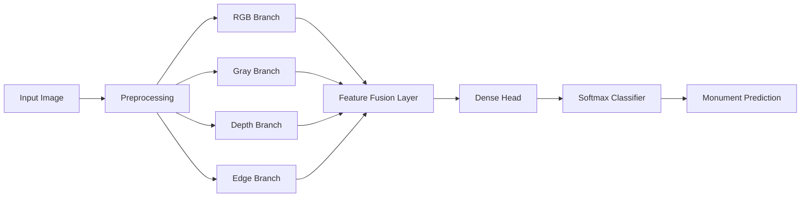

<div align="center">
  <h1>🏛️ Monument AI</h1>
  <h3>Multi-Modal Monument Recognition System (From Scratch)</h3>
  <p>
    <b>Custom Residual CNN • Multi-View Learning • No Pretrained Models</b>
  </p>
  
  <p>
    
    
    
    
  </p>

  <br>

  
  <br><br>
</div>

---

## 🧠 Project Overview

**Monument AI** is a research-oriented deep learning project that performs monument recognition by analyzing images through multiple visual perspectives simultaneously.

Instead of relying on a single RGB image or massive pretrained models (like ResNet/VGG), this project builds a **Custom Multi-Modal Residual CNN from scratch**. It learns complementary representations—**Appearance, Texture, Geometry, and Shape**—to make robust predictions even on limited data.

> ⚠️ **Philosophy:** This project intentionally avoids pretrained backbones to focus on **architecture design, learning stability, and structural reasoning**.

---

## ✨ Key Features

* **🏗️ Custom Architecture:** A handcrafted Residual CNN with skip connections for stable gradient flow.
* **👁️ Multi-Modal Input:**
    * **RGB:** Captures color and general appearance.
    * **Grayscale:** Focuses on lighting invariance and texture.
    * **Depth Map:** Approximates 3D structural geometry.
    * **Edge Map:** Highlights contours and shape boundaries.
* **⚖️ Imbalance Handling:** Uses explicit class weighting and Macro F1-score evaluation.
* **🖥️ Desktop GUI:** A visual inference tool to inspect all 4 input modalities and confidence scores.

---

## 🧠 Why Multi-Modal CNN? (The Research Angle)

Monuments often share similar visual patterns (arches, domes, pillars), making single-view models brittle to lighting or angle changes.

This project injects **Inductive Bias** by separating learning into specialized branches:
1.  **RGB** $\rightarrow$ *Appearance*
2.  **Grayscale** $\rightarrow$ *Texture Robustness*
3.  **Depth** $\rightarrow$ *Structural Layout*
4.  **Edges** $\rightarrow$ *Geometric Shape*

Each branch learns independently, and their features are fused for the final classification. This improves learning stability and explainability.

---

## 🏗️ System Architecture

The model uses parallel Convolutional branches that merge into a dense fusion layer.



---

## 📂 Project Structure

```text
MONUMENT_AI/
├── data/
│   ├── train/                # Training images (Class-wise folders)
│   └── test/                 # Validation / Unseen images
│
├── src/
│   ├── config.py             # Hyperparameters & Paths
│   ├── dataset.py            # Data loader + Multi-view generation
│   ├── model.py              # Custom Multi-modal Residual CNN
│   └── train.py              # Training pipeline
│
├── outputs/
│   └── best_monument_model.h5 # Saved Model Weights
│
├── gui.py                    # Desktop GUI for inference
├── predict.py                # CLI inference script
├── requirements.txt          # Dependencies
└── README.md                 # Documentation

```

---

## 📊 Training Strategy

* **Optimizer:** Adam
* **Loss Function:** Sparse Categorical Cross-Entropy
* **Regularization:** Dropout + Early Stopping + ReduceLROnPlateau
* **Metric:** **Macro F1-Score** (Preferred over accuracy due to class imbalance).

---

## 🚀 How to Run

### 1️⃣ Prerequisites

* Python 3.10+
* GPU Recommended (but runs on CPU).

### 2️⃣ Installation

```bash

# Install dependencies
pip install -r requirements.txt

```

### 3️⃣ Run the GUI Demo

To visualize the 4-modality inputs and test predictions:

```bash
python gui.py

```

### 4️⃣ Train from Scratch

If you want to retrain the model on your own dataset:

```bash
python src/train.py

```

---

## ⚠️ Limitations & Future Work

**Current Limitations:**

* **Dataset Size:** Limited data means the model is experimental.
* **Depth Estimation:** Depth maps are approximated from 2D images, not sensor-grade.
* **Windows Tooling:** The GUI is optimized for Windows.

**Future Roadmap:**

* [ ] Implement **Attention Mechanisms** for better feature fusion.
* [ ] Integrate state-of-the-art Monocular Depth Estimation.
* [ ] Ablation study to compare Single-Modal vs. Multi-Modal performance.

---

<div align="center">
<b>Monument AI is not about achieving the highest accuracy — it is about understanding how different visual representations contribute to machine perception.</b>


<i>Educational & Research Project</i>
</div>

```

```
